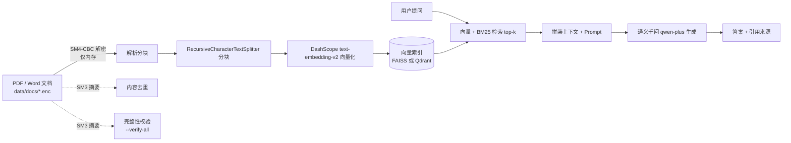

# EnterpriseKB — 企业知识库智能问答系统

基于 **RAG（检索增强生成）** 的企业知识库问答系统。上传 PDF / Word(.docx) 文档，系统自动完成解析、分块、向量化与索引构建；提问时检索相关片段，交由大模型生成**带引用来源与定位（PDF 页码 / Word 段落号）**的回答。

> **当前状态**：阶段一（最小可用 RAG 链路）、阶段二（核心功能完善：混合检索 / Reranker / 流式输出 / 多轮对话）、阶段三（国密安全层：SM4 加密存储 / SM3 完整性校验 / 内容去重）已完成。
> 详细实施计划与进度见 [`路线图进度.md`](路线图进度.md)，安全设计边界见 [`SECURITY.md`](SECURITY.md)。

---

## 功能特性

### ✅ 已实现

| 功能 | 说明 |
|---|---|
| 文档解析 | PDF 用 PyMuPDF 逐页提取（页码 1-based）；Word(.docx) 用 python-docx 提取段落与表格文本（无页码，用段落号定位） |
| 文档分块 | `RecursiveCharacterTextSplitter`，chunk_size=500，overlap=50 |
| 标题增强 | 启发式识别章节标题（章节号 / 数字编号 / 加粗短行），拼到该节每个分块的正文前，形如 `[标题] 第三章 报销流程` |
| 分块标识 | 每个分块带全局唯一 `chunk_id`（`{file_name}_p{page}_{i}`），作为 RRF 融合的 key |
| 向量化 | 通义千问 `text-embedding-v2`（中文效果好，无需本地下载模型） |
| **双向量后端** | FAISS（本地文件，免 Docker）/ Qdrant（Docker 服务）通过 `.env` 一键切换 |
| 增量入库 | 索引已存在时追加而非覆盖；已入库文件自动跳过 |
| **国密加密存储** | 文档以 **SM4-CBC**（随机 IV + PKCS7）加密落盘为 `.enc`，明文不驻留磁盘；解析走内存（`pymupdf.open(stream=...)` / `docx.Document(BytesIO(...))`），不经临时文件；`ENCRYPT_STORE=false` 可退回明文模式 |
| **SM3 内容去重** | 按**内容**摘要（而非文件名）判重：同一份文档改名后重传也会被拦下；`SM3_DEDUP=false` 可关闭 |
| **完整性校验** | 解析前重算 SM3 与索引中记录的摘要比对，`--verify-all` 一键巡检，可发现文档被改动或密文损坏 |
| **密钥管理** | 三级优先级（环境变量 > 密钥文件 > 自动生成并告警）；密文、`.bak` 备份与密钥文件全部由 `.gitignore` 拦在仓库外 |
| **混合检索** | 向量召回 + BM25 关键词召回（jieba 中文分词），RRF（k=60）融合，可用 `HYBRID_RETRIEVAL=false` 关闭 |
| **Reranker 重排** | DashScope `qwen3-rerank` API 对 top-N 候选重排；API 失败自动降级为 RRF 顺序 |
| 引用溯源 | 回答末尾列出来源文件名；PDF 显示「第 N 页 第 M-N 段」，Word 显示「无页码 第 M-N 段」；带 [i] 编号并与正文 (来源：[i]) 对齐；自动去重 |
| **多轮对话** | 支持「那交通费怎么算？」「它适用于哪些人？」等指代式追问；检索前用 LLM 把追问改写成独立查询（Query Rewrite），改写只影响检索、不影响回答 |
| 双入口 | FastAPI REST 接口 + Gradio 可视化界面（同一进程挂载） |
| 失败回滚 | 上传采用临时文件中转，入库失败自动清理，不污染知识库 |

### 🔄 规划中（对应路线图阶段四 ~ 五）

- **RAG 质量评测体系**：Hit Rate / MRR / LLM-as-judge 对比实验
- **工程化收尾**：单元测试补全、CI、Docker 部署与演示材料

---

## 技术栈

| 层级 | 选型 | 理由 |
|---|---|---|
| 语言 | Python 3.13 | AI 生态第一语言 |
| 编排框架 | LangChain 1.4 | 主流 LLM 应用框架 |
| 向量库 | **FAISS + Qdrant 双后端** | FAISS 免 Docker 即开即用；Qdrant 生产级、支持服务端部署 |
| Embedding | DashScope `text-embedding-v2` | 中文效果好，API 调用免本地下载 |
| 关键词检索 | jieba + rank-bm25 | 中文分词是 BM25 生效的前提 |
| 重排序 | DashScope `qwen3-rerank` | API 调用免下载约 2GB 本地重排模型 |
| 大模型 | 通义千问 `qwen-plus` | 国内可用，API 成本低 |
| 文档解析 | PyMuPDF + python-docx | 轻量，PDF 逐页 / Word 段落表格 |
| 加密存储 | **SM4-CBC**（`cryptography`） | 国密对称算法；项目原有依赖即支持，**零新增依赖**（不引入 gmssl） |
| 摘要 / 去重 | **SM3**（`hashlib`） | 一份摘要同时做内容去重与完整性校验，与官方测试向量一致 |
| 后端 | FastAPI | 异步支持，自带 Swagger 文档 |
| 界面 | Gradio 6 | 快速搭建演示界面 |

> **为什么做双后端？**
> 默认走 **FAISS**：克隆仓库后 `pip install` 即可跑，面试官本地没有 Docker 也能直接运行。
> 需要生产级能力或并发访问时，切到 **Qdrant**（Docker 起服务）。两套后端 API 一致，切换零代码改动。

---

## 架构与数据流



> 注意虚线：SM3 摘要同时服务**去重**（入库时）与**完整性校验**（巡检时），
> 一份摘要两处复用。摘要对**明文**计算 —— 密文带随机 IV，每次加密都不同，对密文算摘要是没有意义的。

---

## 快速开始

### 1. 环境准备

要求：Python 3.13、已创建虚拟环境。使用 Qdrant 后端还需安装 Docker Desktop 并启动 Qdrant 容器。

```bash
# 创建并激活虚拟环境（如尚未创建）
python -m venv venv
venv\Scripts\activate

# 安装依赖
pip install -r requirements.txt
```

### 2. 配置 API Key

在项目根目录创建 `.env` 文件（已被 `.gitignore` 忽略，不会提交）：

```bash
cp .env.example .env      # Windows: copy .env.example .env
```

完整可配置项见 [`.env.example`](.env.example)（含逐项注释），核心项如下：

```ini
# 必填：通义千问 / DashScope API Key
DASHSCOPE_API_KEY=sk-xxxxxxxx

# 大模型与分块参数
LLM_MODEL=qwen-plus
CHUNK_SIZE=500
CHUNK_OVERLAP=50

# 向量后端：faiss 或 qdrant
VECTOR_BACKEND=qdrant
QDRANT_HOST=localhost
QDRANT_PORT=6333
QDRANT_COLLECTION=enterprise_kb

# 检索：混合检索（向量 + BM25，RRF 融合）与 Reranker 重排
HYBRID_RETRIEVAL=true
RERANK_ENABLED=true
RERANK_TOP_N=10
RERANK_MODEL=qwen3-rerank

# 多轮对话
MAX_HISTORY_TURNS=5
MAX_HISTORY_CHARS=500
MULTITURN_REWRITE=true

# 国密安全层
ENCRYPT_STORE=true
SM3_DEDUP=true
# 留空则回退到密钥文件；用 --gen-key 生成
SM4_KEY=
SM4_KEY_FILE=data/.sm4_key
```

> **关于国密密钥**：`SM4_KEY` 留空时，首次运行会自动生成一份开发密钥写入
> `data/.sm4_key` 并打 WARNING —— 这是为了"克隆即跑"的便利，**不是安全默认值**。
> 生产环境请用 `--gen-key` 生成后通过环境变量注入，并务必**不要提交进仓库**。
> ⚠️ **密钥丢失 = 密文永久无法恢复**，请独立备份密钥。

> **关于 Reranker**：走 DashScope API（`TextReRank`），不下载本地模型。
> `gte-rerank` 已于 2026-05-30 下线，默认改用官方迁移目标 `qwen3-rerank`；
> 模型名通过 `RERANK_MODEL` 配置，后续如有变更改 `.env` 一行即可，无需改代码。
> API 调用失败会自动降级为 RRF 融合结果，不中断问答。

> **关于多轮对话**：历史由前端携带（REST 无状态）。**第一轮不传历史时不会调用改写**，
> 行为与单轮完全一致；改写失败会记 warning 并回退用原问题检索，不中断问答。
> `MULTITURN_REWRITE=false` 可关闭改写（仍保留历史进 prompt）。

> 使用 Qdrant 后端时，启动服务前请先确保 Docker 中的 Qdrant 在运行：
> ```bash
> docker start qdrant          # 已创建过容器时
> # 或首次拉起：
> docker run -d --name qdrant -p 6333:6333 qdrant/qdrant
> ```

### 3. 构建索引

把 PDF / Word(.docx) 文档放入 `data/docs/`（仓库不收录文档，请自行放入），然后执行：

```bash
venv\Scripts\python.exe -m app.ingestion
```

追加新文档后重新执行即可；需要全量重建时加 `--rebuild`：

```bash
venv\Scripts\python.exe -m app.ingestion --rebuild
```

> `--rebuild` 会重新调用 DashScope 向量化**全部文档**，耗时且产生 API 费用。
> 仅当分块逻辑或嵌入模型变更时才需要；日常追加文档直接跑上面的增量命令即可。

#### 国密加密（可选，默认开启）

开启 `ENCRYPT_STORE=true`（默认）时，通过 `/api/ingest` 或界面上传的文档会**自动加密落盘**，
无需手动操作。已有的历史明文文档用下面这条命令一次性加密：

```bash
venv\Scripts\python.exe -m app.crypto --encrypt-all
```

原明文**不会删除**，而是改名保留为 `.bak`（批量加密不可逆，留个后悔药）。
加密后 `.enc` 与 `.bak` 并存，`.bak` 已被 `.gitignore` 忽略。

```bash
# 巡检：解密重算 SM3，与索引里的摘要比对，列出异常文件
venv\Scripts\python.exe -m app.crypto --verify-all

# 自测：SM3 官方测试向量 + SM4 往返 + IV 随机性
venv\Scripts\python.exe -m app.crypto --selftest

# 生成 SM4 密钥（生产环境用）
venv\Scripts\python.exe -m app.crypto --gen-key

# 需要退回明文存储时
venv\Scripts\python.exe -m app.crypto --decrypt-all

# 单元测试（不需要 API key）
venv\Scripts\python.exe -m pytest tests/test_crypto.py -q
```

> **加密后不需要 `--rebuild`**：加密只改变磁盘存储形态，分块内容与 `sm3_hash` 都不变，
> 已有索引继续有效。
>
> **确认系统跑通后请自行删除 `.bak`**（它们等价于未加密的原文）：`del data\docs\*.bak`

### 4. 启动服务

```bash
venv\Scripts\python.exe -m uvicorn app.main:app --port 8000 --reload
```

Windows 用户也可以直接双击 `启动服务.bat`（会检查索引并启动；Qdrant 模式下请先确保 Docker 中 Qdrant 已运行）。

浏览器打开 <http://localhost:8000> 使用 Gradio 界面（知识问答 + 文档入库两个 Tab）。
知识问答为多轮对话式（Chatbot）+ 流式输出：先显示"已检索到 N 个参考片段"，
答案逐字追加，结束后列出参考来源；同一会话内可直接用「它」「那…呢」追问。

---

## API 接口

| 方法 | 路径 | 说明 |
|---|---|---|
| GET | `/api/health` | 健康检查，返回模型名、后端类型、索引状态与加密开关（`encrypt_store` / `sm3_dedup`） |
| POST | `/api/ingest` | 上传 PDF / Word 并入库（multipart/form-data） |
| POST | `/api/ask` | 提问，返回答案与来源列表（等待完整生成后一次性返回）；可选传 `history` 多轮追问 |
| POST | `/api/ask/stream` | 提问，**SSE 流式返回**（`sources` → 多个 `delta` → `done`，结束发 `data: [DONE]`）；可选传 `history` |

示例：

```bash
curl -X POST http://localhost:8000/api/ask \
  -H "Content-Type: application/json" \
  -d "{\"question\": \"文档中提到的流程有哪些？\"}"
```

多轮追问（历史由前端携带，格式为 `{"role": "user"|"assistant", "content": "..."}`）：

```bash
curl -X POST http://localhost:8000/api/ask \
  -H "Content-Type: application/json" \
  -d '{
    "question": "那交通费怎么算？",
    "history": [
      {"role": "user", "content": "外派人员的住宿费标准是什么？"},
      {"role": "assistant", "content": "住宿费按城市分档，一线城市每晚上限 500 元……"}
    ]
  }'
```

> `history` 不传或传空数组即单轮，行为与之前完全一致；
> 传了历史时系统会先把追问改写成独立查询再检索（日志打印 `多轮检索改写：… → …`），
> 但**回答仍基于用户原始问题生成**，避免改写偏差影响答案。

返回：

```json
{
  "answer": "……",
  "sources": [
    { "file_name": "example.pdf", "page": 3, "chunk_id": "example.pdf_p3_7", "snippet": "……" }
  ]
}
```

### 流式接口（SSE）

```bash
curl -N -X POST http://localhost:8000/api/ask/stream \
  -H "Content-Type: application/json" \
  -d "{\"question\": \"差旅住宿费的报销标准是什么？\"}"
```

每行一个事件（JSON），前端按 `type` 处理即可：

```
data: {"type": "sources", "sources": [{ "file_name": "...", "page": 0, "snippet": "..." }]}
data: {"type": "delta", "text": "一线城市"}
data: {"type": "delta", "text": "住宿费上限"}
data: {"type": "done", "answer": "……", "sources": [...]}
data: [DONE]
```

> 实现要点：`ChatTongyi` 默认 `streaming=False`，此时 `.stream()` 会退化成"生成完一次性返回"（实测仅 1 个 chunk），
> 必须显式传 `streaming=True` 才会逐 token 吐出；Gradio 侧需 `demo.queue()` 才会把每次 yield 推送到前端。

---

## 项目结构

```
enterprise-kb-rag/
├── app/
│   ├── config.py          # 环境变量与全局配置、日志初始化
│   ├── crypto.py          # 国密安全层：SM4 加解密 / SM3 摘要 / 密钥管理 + CLI
│   ├── vector_store.py    # 向量索引（FAISS + Qdrant 双后端抽象层）
│   ├── ingestion.py       # 文档(PDF/Word) → 分块 → 向量化 → 入库（含去重、加密与回滚）
│   ├── retrieval.py       # 检索（混合+重排）→ 多轮查询改写 → 拼装 Prompt → 调用 LLM
│   └── main.py            # FastAPI 路由 + Gradio 界面挂载
├── tests/
│   └── test_crypto.py     # 国密层单元测试（SM3 向量 / SM4 往返 / IV 随机性 / 密钥解析）
├── data/
│   └── docs/              # 知识库文档（.enc 密文，自行放入，不纳入 Git）
├── SECURITY.md            # 安全设计说明：威胁模型、加密范围、密钥管理、已知限制
├── 启动服务.bat            # Windows 一键启动脚本
├── 路线图进度.md           # 分阶段实施进度与执行说明
├── requirements.txt
├── .env.example           # 配置模板（纳入 Git，只有占位符）
└── .env                   # 实际配置（不纳入 Git）
```

---

## 向量后端切换

通过 `.env` 中的 `VECTOR_BACKEND` 切换，无需改动代码：

| 值 | 依赖 | 适用场景 |
|---|---|---|
| `faiss` | 无（本地文件索引） | 快速验证、无 Docker 环境、克隆即跑 |
| `qdrant` | Docker 中的 Qdrant 服务（localhost:6333） | 生产部署、并发访问、服务端管理 |

---

## 路线图

| 阶段 | 内容 | 状态 |
|---|---|---|
| 一 | 环境搭建与最小 RAG 链路（双后端可用） | ✅ 完成 |
| 二 | 混合检索、Reranker、流式输出、多轮对话 | ✅ 完成 |
| 三 | 国密安全层（SM4 加密 + SM3 校验 + 内容去重） | ✅ 完成 |
| 四 | RAG 质量评测体系（Hit Rate / MRR / LLM-judge） | ⬜ 待开始 |
| 五 | 单元测试、CI、Docker 部署、文档与演示材料 | ⬜ 待开始 |

---

## 已知限制

- 当前支持 PDF 与 Word(.docx)；尚未支持 Markdown、扫描件图片（图片内文字读不到）。
- 不支持文档删除：删除 `data/docs/` 中的文件后，索引里的分块不会同步移除（需 `--rebuild` 重建）。
- 同一份文档**改了内容但保持同名**时，仍会被 `source` 去重拦下（既有行为，未改成覆盖更新），需要先做文档删除才能重新入库 —— 这也是上一条的连带影响。

### 国密安全层的边界（详见 [`SECURITY.md`](SECURITY.md)）

- **索引里的分块文本是明文**：向量检索、BM25、Reranker 都需要读原文，payload 加密会让检索不可用（见 SECURITY.md 第 3 节）。本层保护的是 `data/docs/` 下**磁盘上的原始文档**，不保护向量库内容。
- **不防有权限的访问者**：能连上向量库或调用 `/api/ask` 的人本来就能读到内容，加密存储不改变这一点。索引侧防护应落在部署层（内网监听、Qdrant API Key、磁盘加密）。
- **SM3 不是 MAC、不是签名**：可检测意外损坏与明显篡改，但**不具备抗伪造能力** —— 能改密文的人也能改同机的摘要记录。
- **SM4-CBC 不带认证**：填充校验有约 1/256 概率漏掉随机篡改，不防重放与块重排；如需认证加密应改用 SM4-GCM（本阶段未做）。
- **密钥无生命周期管理**：不支持在线轮换、无 KMS/HSM 集成、无解密审计日志。**密钥丢失 = 密文永久无法恢复**，请独立备份。
- **批量加密会保留明文备份**：`--encrypt-all` 把原文件改名 `.bak` 而非删除（避免不可逆），确认无误后请自行清理。
- `--verify-all` 比对的是**磁盘文件与索引中的摘要**：文档尚未入库时会提示"在索引里找不到该内容"，属提示而非错误。
- `ENCRYPT_STORE=false` 会退回明文存储，此时本层不提供任何保护，仅供对照演示与排查。
- 多轮对话的历史**只在单次请求内有效**：REST 无状态，历史由前端携带（Gradio 用 `gr.State` 存）；服务端不保存会话。
- 历史仅用于**消解指代**，不作为事实依据（prompt 里已明确要求），且最多携带 `MAX_HISTORY_TURNS` 轮、单条截断到 `MAX_HISTORY_CHARS` 字符。
- 会话过长时早期轮次会被截断，指代到很早之前的对象可能失效。
- 流式输出为同步生成器实现，`/api/ask/stream` 每次请求占用一个线程（当前知识库规模下无压力）。
- Qdrant 后端依赖 Docker 服务运行；服务未启动时报错而非静默降级。

---

## License

MIT
