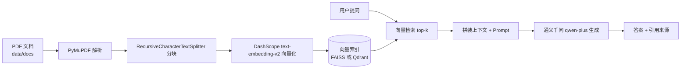

# EnterpriseKB — 企业知识库智能问答系统

基于 **RAG（检索增强生成）** 的企业知识库问答系统。上传 PDF 文档，系统自动完成解析、分块、向量化与索引构建；提问时检索相关片段，交由大模型生成**带引用来源与页码**的回答。

> **当前状态**：阶段一（最小可用 RAG 链路）已完成；阶段二（核心功能完善）进行中。
> 详细实施计划与进度见 [`路线图进度.md`](路线图进度.md)。

---

## 功能特性

### ✅ 已实现

| 功能 | 说明 |
|---|---|
| PDF 解析 | PyMuPDF 逐页提取文本，页码自动转为 1-based（人类可读页码） |
| 文档分块 | `RecursiveCharacterTextSplitter`，chunk_size=500，overlap=50 |
| 向量化 | 通义千问 `text-embedding-v2`（中文效果好，无需本地下载模型） |
| **双向量后端** | FAISS（本地文件，免 Docker）/ Qdrant（Docker 服务）通过 `.env` 一键切换 |
| 增量入库 | 索引已存在时追加而非覆盖；已入库文件自动跳过 |
| 检索问答 | 向量相似度检索 top-k → 拼接上下文 → 大模型生成 |
| 引用溯源 | 回答末尾自动列出来源文件名与页码，自动去重 |
| 双入口 | FastAPI REST 接口 + Gradio 可视化界面（同一进程挂载） |
| 失败回滚 | 上传采用临时文件中转，入库失败自动清理，不污染知识库 |

### 🔄 规划中（对应路线图阶段二 ~ 五）

- 流式输出与多轮对话
- 混合检索（向量 + BM25 关键词，RRF 融合）
- BGE-Reranker 重排序
- 查询改写（Query Rewrite）
- **国密安全层**：SM4 文档加密存储 + SM3 完整性校验 + 内容去重
- **RAG 质量评测体系**：Hit Rate / MRR / LLM-as-judge 对比实验

---

## 技术栈

| 层级 | 选型 | 理由 |
|---|---|---|
| 语言 | Python 3.13 | AI 生态第一语言 |
| 编排框架 | LangChain 1.4 | 主流 LLM 应用框架 |
| 向量库 | **FAISS + Qdrant 双后端** | FAISS 免 Docker 即开即用；Qdrant 生产级、支持服务端部署 |
| Embedding | DashScope `text-embedding-v2` | 中文效果好，API 调用免本地下载 |
| 大模型 | 通义千问 `qwen-plus` | 国内可用，API 成本低 |
| 文档解析 | PyMuPDF | 轻量，PDF 解析质量好 |
| 后端 | FastAPI | 异步支持，自带 Swagger 文档 |
| 界面 | Gradio 6 | 快速搭建演示界面 |

> **为什么做双后端？**
> 默认走 **FAISS**：克隆仓库后 `pip install` 即可跑，面试官本地没有 Docker 也能直接运行。
> 需要生产级能力或并发访问时，切到 **Qdrant**（Docker 起服务）。两套后端 API 一致，切换零代码改动。

---

## 架构与数据流



---

## 快速开始

### 1. 环境准备

要求：Python 3.13、已创建虚拟环境。使用 Qdrant 后端还需安装 Docker Desktop 并启动 Qdrant 容器。

```bash
# 创建并激活虚拟环境（如尚未创建）
python -m venv venv
venv\Scripts\activate

# 安装依赖
pip install -r requirements.txt
```

### 2. 配置 API Key

在项目根目录创建 `.env` 文件（已被 `.gitignore` 忽略，不会提交）：

```ini
# 必填：通义千问 / DashScope API Key
DASHSCOPE_API_KEY=sk-xxxxxxxx

# 大模型与分块参数
LLM_MODEL=qwen-plus
CHUNK_SIZE=500
CHUNK_OVERLAP=50

# 向量后端：faiss 或 qdrant
VECTOR_BACKEND=qdrant
QDRANT_HOST=localhost
QDRANT_PORT=6333
QDRANT_COLLECTION=enterprise_kb
```

> 使用 Qdrant 后端时，启动服务前请先确保 Docker 中的 Qdrant 在运行：
> ```bash
> docker start qdrant          # 已创建过容器时
> # 或首次拉起：
> docker run -d --name qdrant -p 6333:6333 qdrant/qdrant
> ```

### 3. 构建索引

把 PDF 放入 `data/docs/`（仓库不收录 PDF，请自行放入文档），然后执行：

```bash
venv\Scripts\python.exe -m app.ingestion
```

追加新文档后重新执行即可；需要全量重建时加 `--rebuild`：

```bash
venv\Scripts\python.exe -m app.ingestion --rebuild
```

### 4. 启动服务

```bash
venv\Scripts\python.exe -m uvicorn app.main:app --port 8000 --reload
```

Windows 用户也可以直接双击 `启动服务.bat`（会检查索引并启动；Qdrant 模式下请先确保 Docker 中 Qdrant 已运行）。

浏览器打开 <http://localhost:8000> 使用 Gradio 界面（知识问答 + 文档入库两个 Tab）。

---

## API 接口

| 方法 | 路径 | 说明 |
|---|---|---|
| GET | `/api/health` | 健康检查，返回模型名、后端类型与索引状态 |
| POST | `/api/ingest` | 上传 PDF 并入库（multipart/form-data） |
| POST | `/api/ask` | 提问，返回答案与来源列表 |

示例：

```bash
curl -X POST http://localhost:8000/api/ask \
  -H "Content-Type: application/json" \
  -d "{\"question\": \"文档中提到的流程有哪些？\"}"
```

返回：

```json
{
  "answer": "……",
  "sources": [
    { "file_name": "example.pdf", "page": 3, "snippet": "……" }
  ]
}
```

---

## 项目结构

```
enterprise-kb-rag/
├── app/
│   ├── config.py          # 环境变量与全局配置、日志初始化
│   ├── vector_store.py    # 向量索引（FAISS + Qdrant 双后端抽象层）
│   ├── ingestion.py       # PDF → 分块 → 向量化 → 入库（含去重与回滚）
│   ├── retrieval.py       # 检索 → 拼装 Prompt → 调用 LLM → 返回答案与来源
│   └── main.py            # FastAPI 路由 + Gradio 界面挂载
├── data/
│   └── docs/              # 知识库原始 PDF（自行放入，不纳入 Git）
├── 启动服务.bat            # Windows 一键启动脚本
├── 路线图进度.md           # 分阶段实施进度与执行说明
├── requirements.txt
└── .env                   # 配置文件（不纳入 Git）
```

---

## 向量后端切换

通过 `.env` 中的 `VECTOR_BACKEND` 切换，无需改动代码：

| 值 | 依赖 | 适用场景 |
|---|---|---|
| `faiss` | 无（本地文件索引） | 快速验证、无 Docker 环境、克隆即跑 |
| `qdrant` | Docker 中的 Qdrant 服务（localhost:6333） | 生产部署、并发访问、服务端管理 |

---

## 路线图

| 阶段 | 内容 | 状态 |
|---|---|---|
| 一 | 环境搭建与最小 RAG 链路（双后端可用） | ✅ 完成 |
| 二 | 流式输出、混合检索、Reranker、多轮对话 | 🔄 进行中 |
| 三 | 国密安全层（SM4 加密 + SM3 校验 + 内容去重） | ⬜ 待开始 |
| 四 | RAG 质量评测体系（Hit Rate / MRR / LLM-judge） | ⬜ 待开始 |
| 五 | 单元测试、CI、Docker 部署、文档与演示材料 | ⬜ 待开始 |

---

## 已知限制

- 当前仅支持 PDF，未支持 Word / Markdown。
- 重复入库判断基于**归一化文件路径**：同一份 PDF 改名后重传会被当成新文档重复入库（计划用 SM3 内容摘要替代，顺便兼做完整性校验）。
- 不支持文档删除：删除 `data/docs/` 中的文件后，索引里的分块不会同步移除（需 `--rebuild` 重建）。
- 单次提问无上下文记忆，暂不支持多轮对话（阶段二规划）。
- Qdrant 后端依赖 Docker 服务运行；服务未启动时报错而非静默降级。

---

## License

MIT
